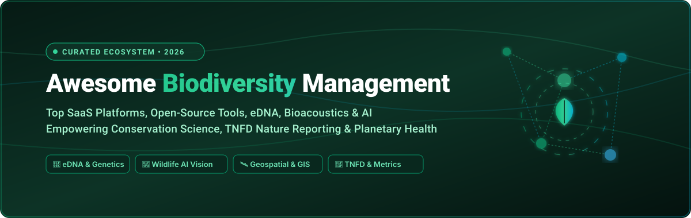

<div align="center">



# 🌿 Awesome Biodiversity Management 🌍

[](https://github.com/ishandutta2007/Awesome-Awesome-Awesome)
<a href="https://discord.gg/jc4xtF58Ve"></a>
[](https://github.com/ishandutta2007/Awesome-Biodiversity-Management/stargazers)
[](https://github.com/ishandutta2007/Awesome-Biodiversity-Management/network/members)
[](https://github.com/ishandutta2007/Awesome-Biodiversity-Management/issues)
[](https://opensource.org/licenses/MIT)
[](https://github.com/ishandutta2007/Awesome-Biodiversity-Management/pulls)
<a href="https://github.com/ishandutta2007"></a>

**A curated collection of leading SaaS platforms, AI vision models, eDNA diagnostics, bioacoustics pipelines, and open-source geospatial tools for species monitoring, habitat conservation, and TNFD nature reporting.**

*Last updated: August 2026*

---

</div>

## 📌 Table of Contents
- [📖 Overview & SEO Keywords](#-overview--seo-keywords)
- [🏢 SaaS Platforms](#-saas-platforms)
- [💻 Open-Source GitHub Projects](#-open-source-github-projects)
- [🛠️ Key Technology Pillars](#️-key-technology-pillars)
- [📈 Star History](#-star-history)
- [🤝 How to Contribute](#-how-to-contribute)
- [⚖️ Disclaimer & Data Ethics](#️-disclaimer--data-ethics)

---

## 📖 Overview & SEO Keywords

> **Keywords**: *Biodiversity Management, Nature-Tech, eDNA Sequencing, Environmental DNA, TNFD Reporting, CSRD Nature Metrics, Camera Trap AI, MegaDetector, Bioacoustics, Species Distribution Modeling, Habitat Mapping, Conservation Tech, GIS Ecology, GBIF, iNaturalist, ESG Biodiversity Accounting.*

This repository curates enterprise-grade **SaaS platforms** and high-impact **open-source repositories** designed for **Biodiversity Management**, ecological restoration, and environmental intelligence. These technologies empower conservationists, researchers, ESG compliance teams, and sustainability leaders to:
- 🧬 Analyze environmental DNA (eDNA) for non-invasive aquatic and terrestrial species discovery.
- 📸 Deploy deep learning AI models for automated camera-trap wildlife identification.
- 🛰️ Monitor global land-use change, deforestation, and ecosystem degradation via satellite imagery.
- 📊 Quantify corporate nature footprints and dependencies aligned with **TNFD (Taskforce on Nature-related Financial Disclosures)** and **EU CSRD**.
- 🌐 Build and publish sovereign biodiversity data portals complying with **GBIF Darwin Core** standards.

---

## 🏢 SaaS Platforms

> 🌐 **Market Size & Sector Structure**: The global Biodiversity & Nature-Tech SaaS market is estimated at **$2.5B – $4.2B** in 2026 (projected to reach **$10B+ by 2030** driven by mandatory TNFD adoption and COP15 30x30 targets). The sector is currently **moderately to highly fragmented** across specialized niches (molecular eDNA labs, satellite AI land cover, corporate ESG nature accounting, and conservation fieldwork SaaS) rather than a concentrated "winner-take-all" market.

*Platforms below are sorted by company scale (Valuation / Revenue / Disclosed Funding) in descending order:*

| Platform | Scale / Valuation / Revenue | Description | Starting Pricing | Free Tier / Free Trial Limits |
| :--- | :--- | :--- | :--- | :--- |
| **[Planetly Nature (OneTrust)](https://www.onetrust.com/solutions/esg-sustainability/)** | **$4.5B Valuation** ($920M+ funding / $400M+ ARR) | Corporate sustainability and biodiversity footprint accounting platform enabling nature disclosures (TNFD, CSRD, GRI) and ESG compliance. | **$10,000/year** starting subscription for the core ESG & Nature management module. | **14-day guided proof-of-concept trial** sandbox limited to 5 organizational entity profiles and up to 50 nature/emissions data streams. |
| **[Esri ArcGIS Living Atlas](https://livingatlas.arcgis.com/)** | **$1.2B+ Annual Revenue** (Global GIS market leader) | Curated cloud geospatial repository and spatial analysis suite hosting global biodiversity, ecosystems, protected areas, and habitat change layers. | **$100/year** (ArcGIS for Personal Use) or **$550/year** (ArcGIS Online Creator user license). | **21-day free trial** of ArcGIS Online (includes 1 Creator license, 400 service credits, 2 GB hosted feature storage, and full access to Living Atlas subscriber layers). |
| **[NatureMetrics](https://www.naturemetrics.com/)** | **$52M Funding** (Series B led by Just Climate) | eDNA and molecular biodiversity monitoring platform converting field samples into species and ecological condition metrics for corporate and conservation reporting. | **£335** per standard sample kit (includes sampling kit, sequencing, and lab reporting); Intelligence Platform enterprise tiers starting at **£5,000/year**. | **14-day free trial** for the Intelligence Platform with sample biodiversity survey datasets, interactive mapping, and reporting tools. |
| **[GIST Impact](https://gistimpact.com/)** | **$15.5M+ Funding** (Series B backed by UBS Next & FNZ) | Algorithmic biodiversity and environmental impact valuation engine assessing spatial nature footprints and corporate ecosystem dependencies across global supply chains. | **$15,000/year** starting subscription for SME Nature & Biodiversity Footprint module. | **14-day interactive demo trial** sandbox limited to portfolio screening of up to 5 corporate entities or 1 supply-chain facility. |
| **[Impact Observatory](https://www.impactobservatory.com/)** | **$7.1M Funding** (Seed backed by Esri & geospatial VCs) | AI-driven geospatial environmental intelligence generating high-resolution global land cover maps and continuous habitat/deforestation monitoring. | **$2.00/km²** (10m on-demand land cover) or **$7.50/km²** (3m resolution, minimum order **$500**); Enterprise monitoring from **$12,000/year**. | **Free forever plan** for global annual 10m land cover time-series maps (CC BY 4.0 via Living Atlas/Planetary Computer); **14-day free trial** of IO Monitor for 1 AOI up to 100 km². |
| **[NatureAlpha](https://www.naturealpha.ai/)** | **$4.9M Funding** (Backed by DNV Ventures & FNZ) | AI-driven nature and biodiversity risk analytics platform delivering TNFD-aligned footprinting, materiality metrics, and supply-chain exposure insights for investors. | **£12,000/year** (or **£1,000/month**) for enterprise analytics; Geoverse Explorer entry tier available at **£0**. | **Free forever plan** (Geoverse Explorer) with basic biodiversity risk screening for up to 10 company lookups; **14-day free trial** for Geoverse 2.0 institutional platform. |
| **[OpenForests (explorer.land)](https://www.openforests.com/)** | **$4.1M Funding** (Seed stage, MRV & restoration SaaS) | High-resolution forest and conservation project mapping, storytelling, and field impact monitoring SaaS platform. | **€49/month** per project (Starter tier, or **€34/month** billed annually); Professional tier at **€99/month**. | **Free forever plan** includes 1 mapped project, 1 user, embeddable interactive map, geolocated news posts, and funding directory access; **14-day free trial** for Starter/Pro tiers. |
| **[Map of Life](https://mol.org/)** | **$2.5M+ Grants & Prizes** ($2M XPRIZE winner / Yale) | Global biodiversity spatial platform (Yale) offering species distributions, range maps, habitat metrics, and national indicator decision-support frameworks. | **$500/month** ($6,000/year) for commercial API & custom spatial modeling; **$0** for non-commercial academic research. | **Free forever plan** for public web & mobile app (unlimited global species range lookups, regional checklists up to 50 reports/day, and public API limited to 100 queries/day). |
| **[Climate Engine](https://www.climateengine.org/)** | **$1.5M+ Research Grants** (Supported by NOAA/Google/DRI) | Cloud geospatial computing platform (DRI/NOAA/Google) delivering on-demand environmental, climatic, and vegetation indices for habitat monitoring. | **$250/month** for enterprise Google Earth Engine Connector + dedicated API gateway; **$0** for standard research accounts. | **Free forever plan** with standard web access and API limits of **200 requests/hour**, **500 requests/day**, and **3,000 requests/month** across global datasets. |
| **[Bloom Labs](https://bloomlabs.earth/)** | **Pre-Seed / Bootstrapped** (Reader-supported) | Market intelligence and data platform tracking voluntary biodiversity credit markets, nature credit issuances, pricing indices, and project registries. | **€49/month** (or **€490/year**) for individual researcher tier; **€199/month** for institutional analyst tier. | **Free forever plan** includes bi-weekly market intelligence briefings, public biodiversity credit scheme directory, and summary transaction tracker. |

---

## 💻 Open-Source GitHub Projects

*Open-source projects below are sorted by GitHub Star Count in descending order:*

- **[Biopython](https://github.com/biopython/biopython)** [](https://github.com/biopython/biopython/stargazers)  
  🧬 Foundational Python computational molecular biology toolkit for processing genomic, taxonomic, and environmental DNA (eDNA) sequences.

- **[geemap](https://github.com/gee-community/geemap)** [](https://github.com/gee-community/geemap/stargazers)  
  🛰️ Interactive Python package for geospatial analysis and habitat change detection with Google Earth Engine and ipyleaflet.

- **[BirdNET-Analyzer](https://github.com/kahst/BirdNET-Analyzer)** [](https://github.com/kahst/BirdNET-Analyzer/stargazers)  
  🦜 Deep learning bioacoustics framework recognizing 6,000+ bird species from audio recordings with confidence scoring and batch processing.

- **[BirdNET-Pi](https://github.com/mcguirepr89/BirdNET-Pi)** [](https://github.com/mcguirepr89/BirdNET-Pi/stargazers)  
  📻 Real-time bioacoustic monitoring station for Raspberry Pi capable of continuous audio analysis, bird song spectrograms, and live notifications.

- **[Microsoft MegaDetector / CameraTraps](https://github.com/microsoft/CameraTraps)** [](https://github.com/microsoft/CameraTraps/stargazers)  
  📸 Production-grade AI object-detection pipeline identifying animals, people, and vehicles in millions of camera-trap photos.

- **[iNaturalist](https://github.com/inaturalist/inaturalist)** [](https://github.com/inaturalist/inaturalist/stargazers)  
  🐾 The world's largest open citizen-science biodiversity platform for recording species observations, identifications, and community verifications.

- **[OpenSoundscape](https://github.com/kitzeslab/opensoundscape)** [](https://github.com/kitzeslab/opensoundscape/stargazers)  
  🎧 Python bioacoustics library for training customized neural network classifiers, detecting vocalizations, and calculating acoustic complexity indices.

- **[GeoNature](https://github.com/PnX-SI/GeoNature)** [](https://github.com/PnX-SI/GeoNature/stargazers)  
  🌲 Comprehensive open-source web and mobile ecosystem for managing biodiversity observations and naturalist inventories in national parks and protected reserves.

- **[Wildbook (Wild Me)](https://github.com/WildMeOrg/Wildbook)** [](https://github.com/WildMeOrg/Wildbook/stargazers)  
  🐋 AI and computer-vision platform for individual animal re-identification using biometric patterns (spots, stripes, fluke edges, and facial recognition).

- **[GBIF Integrated Publishing Toolkit (IPT)](https://github.com/gbif/ipt)** [](https://github.com/gbif/ipt/stargazers)  
  🌐 Standardized open-access data repository server used worldwide to publish biodiversity occurrences, checklists, and metadata to the GBIF network.

- **[PyTorch-Wildlife](https://github.com/microsoft/Pytorch-Wildlife)** [](https://github.com/microsoft/Pytorch-Wildlife/stargazers)  
  🤖 Unified PyTorch deep-learning model zoo for conservation computer vision, wildlife classification, and camera-trap edge deployments.

- **[Biodiversity Information Management System (BIMS)](https://github.com/kartoza/bims)** [](https://github.com/kartoza/bims/stargazers)  
  🗺️ Open Django/PostGIS platform for managing, visualizing, and sharing spatial freshwater and terrestrial biodiversity data across institutional portals.

- **[Map of Life Open Repositories (mollib)](https://github.com/MapofLife/mollib)** [](https://github.com/MapofLife/mollib/stargazers)  
  📚 Open data pipelines, species range modeling algorithms, and spatial decision-support tools developed by the Yale Center for Biodiversity and Global Change.

---

## 🛠️ Key Technology Pillars

```
                     ╔══════════════════════════════════════════════╗
                     ║   Biodiversity Management Technology Stack   ║
                     ╚══════════════════════════════════════════════╝
                                            │
        ┌───────────────────┬───────────────┴───────────────┬───────────────────┐
        ▼                   ▼                               ▼                   ▼
 🧬 Molecular & eDNA 📸 Wildlife Vision AI         🛰️ Geospatial & Earth     📊 ESG & TNFD Risk
 ─────────────────── ────────────────────         ─────────────────────     ──────────────────
 • NatureMetrics     • MegaDetector (AI)          • Esri Living Atlas       • NatureAlpha
 • Biopython         • PyTorch-Wildlife           • Google Earth Engine     • Planetly/OneTrust
 • QIIME 2 Pipelines • Wildbook (Biometrics)      • Impact Observatory      • GIST Impact
 • eDNA Metabarcoding• BirdNET-Analyzer           • geemap & QGIS           • Bloom Labs (VBM)
```

---

## 📈 Star History

[](https://star-history.dera.page/#ishandutta2007/Awesome-Biodiversity-Management&type=date&legend=top-left)

---

## 🤝 How to Contribute

Contributions are warmly welcomed! To suggest a new tool, SaaS platform, or open-source repository:

1. 🍴 **Fork** this repository.
2. 🌿 **Create a Branch**: `git checkout -b add-my-biodiversity-tool`
3. 📝 **Add Your Entry**: Keep descriptions factual, provide specific starting pricing / free tier limits for SaaS, or a GitHub star badge for open-source repos.
4. 🚀 **Submit a Pull Request** with a concise summary of the addition.

---

## ⚖️ Disclaimer & Data Ethics

- 📋 This repository is a **community-curated index** for informational and educational purposes — not a commercial endorsement.
- 🦏 **Conservation Ethics**: Sensitive biodiversity records (e.g., exact GPS coordinates of endangered species, indigenous stewardship zones) must adhere to IUCN, national legislation, and GBIF data-generalization standards.
- 🔬 eDNA assays, acoustic classifiers, and satellite models involve confidence thresholds; they supplement but do not replace certified field ecological expertise.

---

<div align="center">

**Made with 💚 for ecologists, nature-tech builders, and sustainability champions protecting planet Earth.**

</div>
